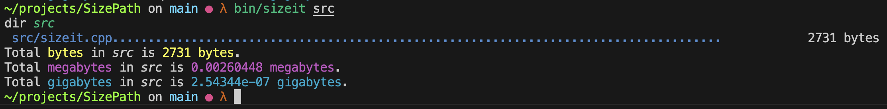
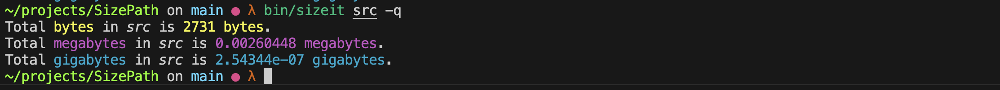

# SizePath
A cli tool written in c++ that determines the size of folders and files.

## Build
`g++ -std=c++17 src/sizeit.cpp  -o bin/sizeit`

## Execute bin
`bin/sizeit <folder_path>`

Use the quiet flag to not output any text but the totals
`bin/sizeit <folder_path> -q`

